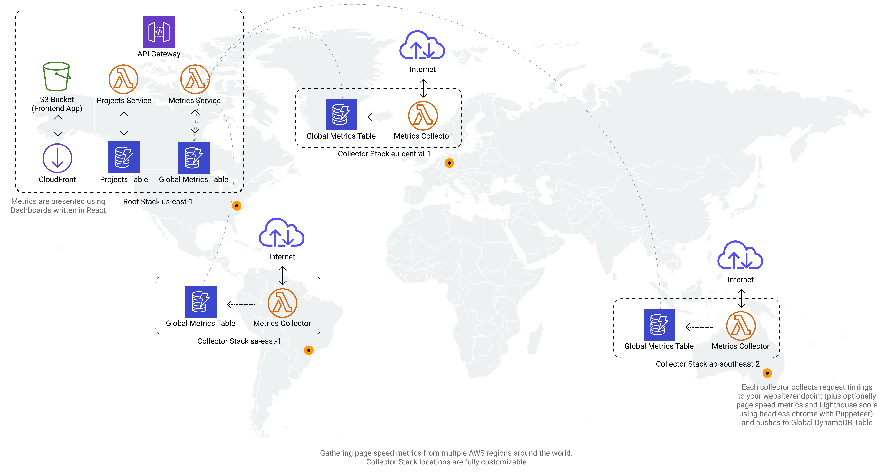

<h1 align="center">Serverless Web Performance Monitor</h1>
<p>
  <a href="https://github.com/gatsbyjs/gatsby-starter-blog/graphs/commit-activity">
    
  </a>
  <a href="https://github.com/gatsbyjs/gatsby-starter-blog/blob/master/LICENSE">
    
  </a>
  <a href="https://twitter.com/rafalwilinski">
    
  </a>
</p>

> Monitor your page/endpoint speed from multiple locations around the world, for free!

### 🏠 [Homepage](https://servicefull.cloud/)

## Install

```sh
yarn
```

## Usage

- `yarn deploy:all` compiles all lambdas, CDK Stack, Frontend application and deploys it to the cloud
- `yarn build:frontend` builds only frontend
- `yarn build:cdk` builds only CDK from TS to JS

## Infrastructure



## Author

👤 **Rafal Wilinski &lt;raf.wilinski@gmail.com&gt;**

- Twitter: [@rafalwilinski](https://twitter.com/rafalwilinski)
- Github: [@RafalWilinski](https://github.com/RafalWilinski)

## 🤝 Contributing

Contributions, issues and feature requests are welcome!<br />Feel free to check [issues page](https://github.com/RafalWilinski/servicefull/issues).

## Show your support

Give a ⭐️ if this project helped you!

## 📝 License

Copyright © 2019 [Rafal Wilinski &lt;raf.wilinski@gmail.com&gt;](https://github.com/RafalWilinski).<br />
This project is [MIT](https://github.com/RafalWilinski/servicefull/blob/master/LICENSE) licensed.
